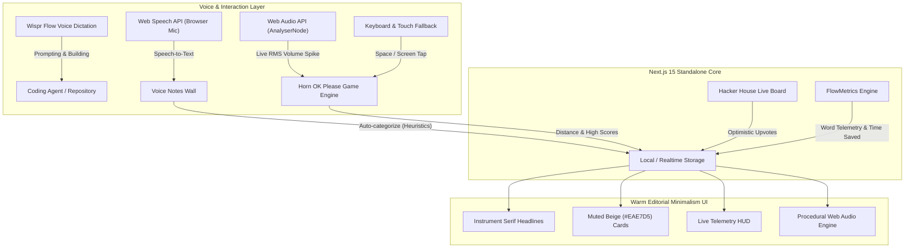

# Hacker House Live Board & "Horn OK Please" Voice Arcade 🛵 🌴

[](./LICENSE)
[](./Dockerfile)
[](https://nextjs.org)
[](./PROMPTS.md)
[](https://flow.wispr.ai)

> **Submission for the Wispr Flow Hackathon**  
> **Core Premise:** Built by voice, designed for voice, and played by voice.  
> **Prompt Audit Trail:** Complete chronological transcript available in [`PROMPTS.md`](./PROMPTS.md).  
> **Live Demo:** Deployable on Vercel, Docker & GitHub Pages.

---

## 🧭 Executive Summary for Judges & Organizers

In a fast-paced hacker house, collaboration happens out loud. Builders talk across rooms, debate architectures, celebrate breakthroughs, and crave quick breaks to unwind.

This application combines two natural hacker house rituals into a single, cohesive web platform:
1. **The House Nerve Center:** A real-time collaboration hub featuring project showcases with instant upvotes, a live demo-day countdown clock, house announcements, and a **Voice Notes Wall** where spoken thoughts are transcribed and auto-categorized directly in the browser.
2. **The Breakroom Voice Arcade ("Horn OK Please"):** An interactive browser game set on a sunset beach road in Goa. Players steer a scooter past stray cows (`🐄`), goats (`🐐`), and road potholes (`🕳️`), jumping obstacles by **shouting or honking into their microphone**.

Every single component, line of code, Dockerfile, and asset in this repository was **prompted and directed 100% by voice** using Wispr Flow.

---

## ⚡ 3-Minute Fast-Track Evaluation Guide for Judges

If you have 3 minutes to evaluate this submission, follow these steps:

| Step | Action | What to Observe |
| :--- | :--- | :--- |
| **1. Launch App** | Open `http://localhost:3000` (or the deployed link) | Notice the **Warm Editorial Minimalism** design system: warm cream canvas (`#FAF8EC`), high-contrast *Instrument Serif* typography, flat beige cards (`#EAE7D5`), and the live Demo Day countdown. |
| **2. Test Voice Notes** | Click the **Voice Notes Wall** tab, hit **🎙️ Record Voice Note**, and speak: *"We need to fix audio latency before the chai break!"* | The browser's native **Web Speech API** transcribes your voice in real time, auto-categorizes the note as a **Blocker 🛑** or **Food & Chai 🥟**, and pins it to the shared wall. |
| **3. Test Upvoting** | Go to the **Project Showcase** tab and click the **▲** upvote button on any project | Observe the optimistic state update: instantaneous counter increment with local storage sync. |
| **4. Play "Horn OK Please"** | Go to the **Horn OK Please** tab, click **Enable Voice Horn**, and press `[Space]` | Make a loud sound (*"PEEP!"* or *"HORN!"*) into your microphone. Watch the live decibel volume meter cross the threshold, hear the procedurally synthesized Indian truck horn, and watch your scooter leap over the cow! |
| **5. Audit Prompts** | Inspect [`PROMPTS.md`](./PROMPTS.md) and the **FlowMetrics** tab | Review the verbatim voice audit trail with timestamps demonstrating that this entire build was prompted via voice. |

---

## 🏛️ System Architecture



---

## 📦 The Four Core Pillars in Detail

### 1. Hacker House Live Board (`Project Showcase`)
- **Real-Time Project Display:** Cards highlighting what housemates are currently shipping, complete with builder tags, tech stack badges, and demo links.
- **Optimistic Upvotes:** Instant feedback upon clicking upvote; syncs with local storage and ready for Supabase Realtime replication.
- **Demo Day Countdown Ticker:** Live ticking countdown clock (`13h 48m`) synchronizing the house toward the final pitch.
- **House Announcements:** Dynamic notice ticker broadcasting emergency updates (e.g. WiFi credentials, food deliveries, arcade high scores).
- **Voice Pitch Dictation:** "+ Submit Project" modal contains a built-in voice recorder allowing builders to dictate their project pitch hands-free.

### 2. Voice Notes Wall (`Voice Notes Wall`)
- **Zero-Cloud Speech Transcription:** Uses the browser-native `SpeechRecognition` API (`webkitSpeechRecognition`) requiring zero API keys, zero backend tokens, and zero external latency.
- **Smart Category Heuristics:** Automatically detects keywords in spoken speech and files notes into four distinct categories:
  - 💡 **Idea:** Default creative sparks and feature proposals.
  - 🛑 **Blocker:** Triggered by words like *"bug"*, *"error"*, *"stuck"*, *"help"*, *"broken"*.
  - 🙌 **Shoutout:** Triggered by words like *"thanks"*, *"kudos"*, *"great job"*, *"props"*.
  - 🥟 **Food & Chai:** Triggered by words like *"chai"*, *"coffee"*, *"food"*, *"lunch"*, *"samosa"*.
- **Telemetry Feeder:** Dictated words automatically flow into the global FlowMetrics telemetry calculator.

### 3. "Horn OK Please" Voice Arcade (`Horn OK Please`)
A cultural homage to Indian highway folklore, where trucks prominently display *"HORN OK PLEASE"* on their rear bumpers:
- **Audio-Driven Jump Mechanics:** An `AnalyserNode` monitors the microphone's input stream at 60 FPS, calculating the Root-Mean-Square (RMS) amplitude. When sound exceeds the user-configured sensitivity threshold, the scooter honks and jumps!
- **Dynamic Obstacles:**
  - 🐄 **Holy Cows:** Lazy cows resting across the road.
  - 🐐 **Goa Goats:** Fast beach goats nibbling on the roadside.
  - 🕳️ **Beach Potholes:** Asphalt craters requiring clean airborne clearance.
- **Harmless Ambient Highway Traffic:**
  - Auto-rickshaws (`🛺`), Indian highway trucks (`🚛`), tourist vans (`🚐`), and motorcycles (`🏍️`) cruise peacefully in the opposite lane, creating a bustling Goa beach atmosphere without causing frustrating collisions.
- **100% Procedural Sound (Zero Audio Files):**
  - **Indian Dual-Tone Horn:** Procedural dual-oscillator (420 Hz sawtooth + 495 Hz triangle) with snappy exponential decay.
  - **Cow Moo:** Modulated low-frequency glide (140 Hz → 115 Hz).
  - **Goat Bleat (Baa):** Vibrato-infused frequency modulation (280 Hz → 320 Hz → 240 Hz).
  - **Crash / Pothole Thud:** Low-frequency filtered square wave noise burst.
- **Accessibility & Fair Play:** Sensitivity calibration slider with a visual threshold line, 400ms noise-debounce cooldown, and full spacebar / screen-tap fallback.

### 4. FlowMetrics Telemetry Hub (`FlowMetrics`)
- **Quantified Voice Productivity:** Tracks real-time telemetry of building by voice:
  - Total words dictated (~1,420+ words).
  - Voice prompts executed.
  - Estimated time saved (~26+ minutes saved assuming 150 WPM dictation vs 40 WPM manual keyboard typing).
  - Modality comparison table comparing voice fluidity against keyboard RSI fatigue.

---

## 🎨 Design Philosophy: "Warm Editorial Minimalism"

Inspired by the refined visual identity of **Wispr Flow** and **Anthropic**:

| Design Token | Specification | Rationale |
| :--- | :--- | :--- |
| **Canvas Background** | Warm Ivory Cream (`#FAF8EC`) | Replaces harsh clinical white `#FFFFFF` with the warmth of high-grade editorial print paper. |
| **Typography (Headlines)**| *Instrument Serif* / *Fraunces* | High-contrast editorial serif, tight letter spacing (`-0.02em`), evoking classic publishing. |
| **Typography (UI & Body)**| *Inter* / *Geist* | Clean geometric sans-serif for legible cards, metadata, and buttons. |
| **Surface Cards** | Muted Beige (`#EAE7D5`) | Flat, grounded fills with zero heavy drop shadows. |
| **Hairline Borders** | `rgba(28, 27, 23, 0.22)` (1px) | Subtle near-black hairline borders defining containers without visual clutter. |
| **Hover Transitions** | Surface darkens to `#E2DFC9` (150ms ease) | Gentle, tactile feedback that feels calm and responsive. |

---

## 🎙️ 100% Built by Voice (Evidence & Audit Trail)

This project was built without manual keyboard coding. Every instruction was spoken aloud to the AI agent.

The complete, chronological record of every prompt given during the hackathon is logged with timestamps in **[`PROMPTS.md`](./PROMPTS.md)**.

### Voice Telemetry Highlights:
- **Total Prompts Dictated:** 10 voice sessions
- **Average Dictation Speed:** ~150 words per minute
- **Typing Keystrokes Eliminated:** ~7,000+ keystrokes
- **Time Saved:** Over 26 minutes of keyboard entry eliminated

---

## 🐳 Quickstart & Running the App

### Option A: Docker Compose (Recommended)

Run the entire application in an isolated container with one command:

```bash
# Clone the repository
git clone https://github.com/Kanhaiya76618/whisper-game.git
cd whisper-game

# Build and start via Docker Compose
docker compose up --build
```
Open **[http://localhost:3000](http://localhost:3000)**.

---

### Option B: Local Node.js Development

```bash
# Clone the repository
git clone https://github.com/Kanhaiya76618/whisper-game.git
cd whisper-game

# Install dependencies
npm install

# Run development server
npm run dev
```
Open **[http://localhost:3000](http://localhost:3000)**.

---

### Option C: Production Docker Build & Run

```bash
docker build -t whisper-game .
docker run -p 3000:3000 whisper-game
```

---

## 🛠️ Tech Stack Overview

- **Framework:** Next.js 15.5 (App Router with `standalone` output)
- **UI Library:** React 19
- **Styling:** Tailwind CSS with custom editorial configuration
- **Audio Processing:** Browser Web Audio API (`AudioContext`, `AnalyserNode`, `OscillatorNode`)
- **Speech Recognition:** Web Speech API (`SpeechRecognition` / `webkitSpeechRecognition`)
- **Icons:** Lucide React
- **Containerization:** Multi-stage Dockerfile (Alpine Linux) + Docker Compose
- **CI/CD:** GitHub Actions (`.github/workflows/ci.yml`)

---

## 🤝 Open Source & Contributing

We welcome community contributions, additional Goa obstacles, custom sound synthesizers, and hacker house features! Please review our [Contributing Guide](./CONTRIBUTING.md) for details on voice-prompted development standards.

Distributed under the [MIT License](./LICENSE). Built with pride for the **Wispr Flow Hackathon**.
